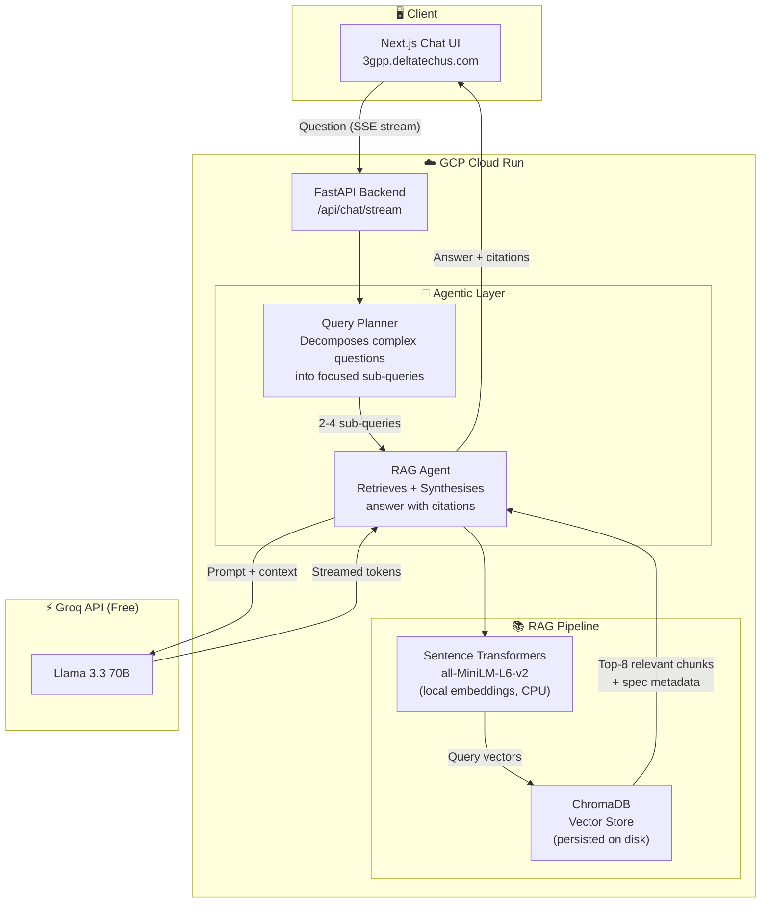
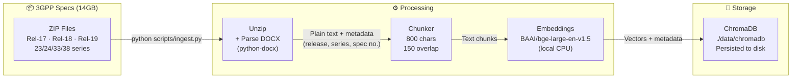
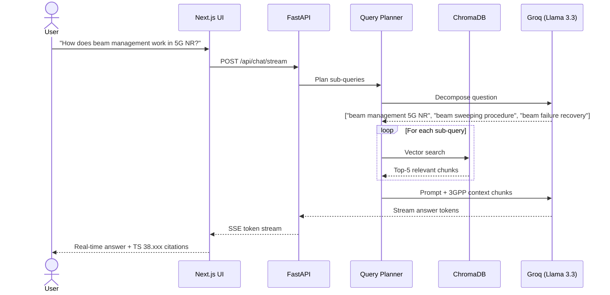

# 3gppSpec — 3GPP AI Assistant

An **Agentic RAG chatbot** over 3GPP telecommunications specifications (Release 17–19).
Ask natural-language questions and get answers with citations, powered by completely free, open-source tools.

- **Groq + Llama 3.3 70B** (LLM — free tier, 14,400 req/day)
- **all-MiniLM-L6-v2** (local embeddings — runs on CPU, no API cost, ~15x faster than large models)
- **ChromaDB** (local vector store — persisted to disk, no server needed)
- **FastAPI** backend with real-time streaming
- **Next.js** chat frontend with source citations
- **GCP Cloud Run** deployment → `https://3gpp.deltatechus.com`

---

## System Architecture



---

## Ingestion Pipeline (One-Time Setup)



---

## Query Flow



---

## Tech Stack

| Layer | Technology | Cost |
|---|---|---|
| LLM | Groq — Llama 3.3 70B | Free (14,400 req/day) |
| Embeddings | sentence-transformers all-MiniLM-L6-v2 | Free (local CPU) |
| Vector DB | ChromaDB | Free (local disk) |
| Backend | FastAPI + Python 3.11 | — |
| Frontend | Next.js 14 + Tailwind CSS | — |
| Hosting | GCP Cloud Run | Free tier |
| IaC | Terraform | — |
| CI/CD | GitHub Actions | Free |

---

## Quick Start (Local)

### 1. Clone and setup

```bash
git clone https://github.com/sohelimi/3gppspec.git
cd 3gppSpec
python -m venv .venv && source .venv/bin/activate
pip install -r requirements.txt
cp .env.example .env
# Edit .env — add your GROQ_API_KEY and SPECS_DIR
```

### 2. Run ingestion (one-time, ~1–2 hours for Rel-18 key series)

```bash
python scripts/ingest.py --releases Rel-18 --series 38_series,23_series
# Full ingestion (Rel-17/18/19, all key series):
python scripts/ingest.py
```

### 3. Start backend

```bash
uvicorn backend.main:app --reload --port 8000
```

### 4. Start frontend

```bash
cd frontend
npm install
npm run dev   # http://localhost:3000
```

---

## Docker (Full Stack)

```bash
cp .env.example .env   # add GROQ_API_KEY
docker-compose up --build
# Backend: http://localhost:8000
# Frontend: http://localhost:3000
```

---

## Deploy to GCP Cloud Run

### Prerequisites

- [GCP account](https://cloud.google.com) (free $300 credits)
- [gcloud CLI](https://cloud.google.com/sdk/docs/install) installed
- [Terraform](https://terraform.io) installed

### Step 1 — Create GCP project

```bash
gcloud projects create YOUR_PROJECT_ID --name="3gppSpec"
gcloud config set project YOUR_PROJECT_ID
gcloud billing accounts list
gcloud billing projects link YOUR_PROJECT_ID --billing-account=BILLING_ACCOUNT_ID
```

### Step 2 — Enable APIs

```bash
gcloud services enable \
  run.googleapis.com \
  artifactregistry.googleapis.com \
  secretmanager.googleapis.com \
  cloudbuild.googleapis.com
```

### Step 3 — Store Groq API key in Secret Manager

```bash
echo -n "YOUR_GROQ_API_KEY" | gcloud secrets create groq-api-key --data-file=-
```

### Step 4 — Run ingestion + build Docker image

```bash
# Run ingestion locally first (builds ChromaDB)
python scripts/ingest.py

# Build and push Docker image (ChromaDB is bundled in)
gcloud auth configure-docker us-central1-docker.pkg.dev
docker build -t us-central1-docker.pkg.dev/YOUR_PROJECT_ID/3gppspec/3gppspec:latest .
docker push us-central1-docker.pkg.dev/YOUR_PROJECT_ID/3gppspec/3gppspec:latest
```

### Step 5 — Deploy with Terraform

```bash
cd infra
cp terraform.tfvars.example terraform.tfvars
# Edit terraform.tfvars — set your project_id
terraform init
terraform apply
```

### Step 6 — Configure DNS (CNAME)

After `terraform apply`, add a CNAME record in your DNS provider:

| DNS Provider | Steps |
|---|---|
| **Cloudflare** | DNS → Add record → Type: CNAME, Name: `3gpp`, Target: `ghs.googlehosted.com` |
| **GoDaddy** | DNS Management → Add CNAME → Host: `3gpp`, Points to: `ghs.googlehosted.com` |
| **Namecheap** | Advanced DNS → Add CNAME Record → Host: `3gpp`, Value: `ghs.googlehosted.com` |

SSL is automatic via Google-managed certificate (~15 min to provision).

---

## CI/CD (GitHub Actions)

Set these secrets in your GitHub repo → Settings → Secrets:

| Secret | Value |
|---|---|
| `GCP_PROJECT_ID` | Your GCP project ID |
| `GCP_WORKLOAD_IDENTITY_PROVIDER` | From GCP IAM |
| `GCP_SERVICE_ACCOUNT` | Service account email |

Every push to `main` automatically builds and deploys to Cloud Run.

---

## Project Structure

```
3gppSpec/
├── backend/
│   ├── agents/
│   │   ├── query_planner.py   # Decomposes questions into sub-queries
│   │   └── rag_agent.py       # Full agentic RAG pipeline + streaming
│   ├── rag/
│   │   ├── ingestion/
│   │   │   ├── extractor.py   # Unzip + parse DOCX files
│   │   │   ├── chunker.py     # Split text into overlapping chunks
│   │   │   └── pipeline.py    # Orchestrates full ingestion
│   │   ├── vectorstore.py     # ChromaDB client + embeddings
│   │   └── retriever.py       # Multi-query retrieval + dedup
│   ├── llm/
│   │   └── groq_client.py     # Groq API (Llama 3.3 70B)
│   ├── api/routes/
│   │   ├── chat.py            # /api/chat and /api/chat/stream
│   │   └── health.py          # /health
│   ├── config.py
│   └── main.py
├── frontend/                  # Next.js 14 chat UI
│   └── src/
│       ├── app/               # Pages + layout
│       ├── components/        # Message, SourceCard
│       └── lib/api.ts         # Streaming API client
├── scripts/
│   ├── ingest.py              # Run ingestion pipeline
│   └── test_rag.py            # Test RAG queries
├── infra/                     # Terraform (GCP Cloud Run)
├── .github/workflows/         # GitHub Actions CI/CD
├── Dockerfile
└── docker-compose.yml
```

---

## Cost Estimate

| Service | Free Tier | Expected Usage |
|---|---|---|
| GCP Cloud Run | 2M req/mo, 360K GB-s compute | Well within free tier |
| Artifact Registry | 0.5 GB free | ~1 GB image (~$0.05/mo) |
| GCP Secret Manager | 6 active secrets free | 1 secret |
| Groq API | 14,400 req/day free | Free |
| Embeddings (BAAI) | Local, no API | Free forever |
| ChromaDB | Local, no API | Free forever |

**Estimated monthly cost: ~$0**

---

## License

MIT — open source, contributions welcome.
